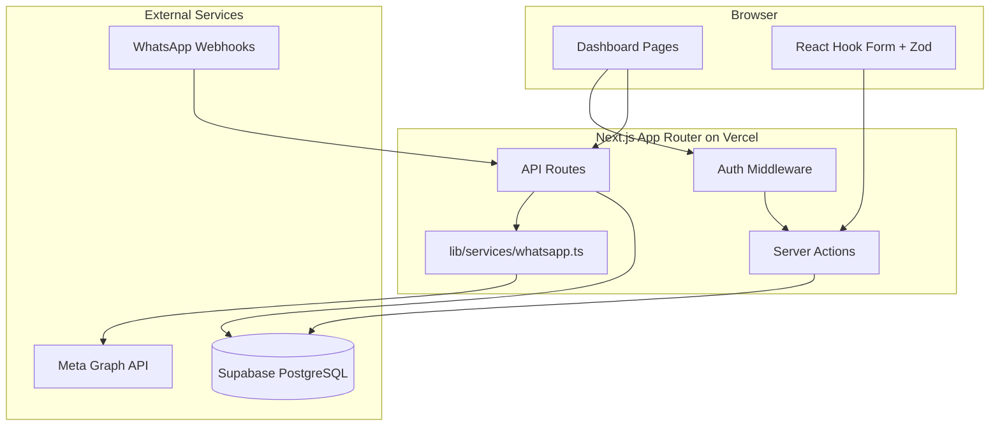
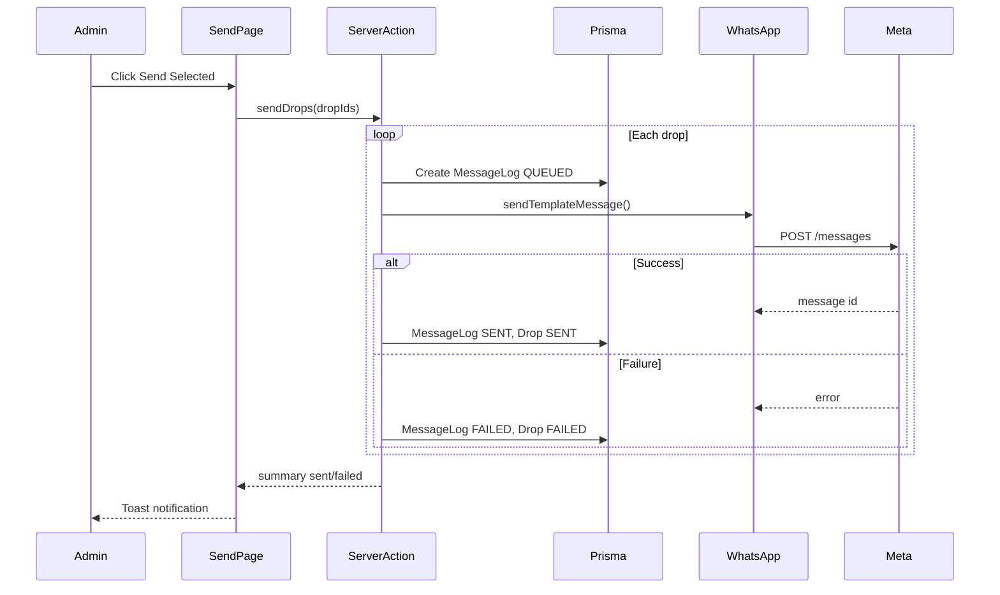

# DriverDrop — Production Next.js Delivery Automation

## Architecture Overview



**Stack choices (per your preferences):**
- **Auth:** NextAuth.js v5 (Auth.js) with Credentials provider + bcrypt-hashed passwords
- **Database:** Supabase PostgreSQL via `DATABASE_URL` (Prisma `postgresql` provider)
- **WhatsApp:** Official Cloud API template messages only (no browser automation)

---

## Phase 1: Project Scaffolding

Initialize in the empty workspace at `/Users/talhazulfiqar/driverdrop`:

```bash
npx create-next-app@latest . --typescript --tailwind --eslint --app --src-dir=false --import-alias="@/*"
npx shadcn@latest init
npx shadcn@latest add button input label card table dialog dropdown-menu select textarea badge toast sonner separator sheet avatar skeleton checkbox form tabs alert-dialog
npm install prisma @prisma/client next-auth@beta bcryptjs zod react-hook-form @hookform/resolvers date-fns libphonenumber-js
npm install -D @types/bcryptjs
npx prisma init
```

**Key config files:**
- [`.env.example`](.env.example) — all required vars documented
- [`next.config.ts`](next.config.ts) — server actions enabled (default in Next 15)
- [`middleware.ts`](middleware.ts) — protect `/dashboard`, `/drivers`, `/drops`, `/assign-drops`, `/send-drops`, `/message-logs`, `/settings`

---

## Phase 2: Database Schema (Prisma + Supabase)

[`prisma/schema.prisma`](prisma/schema.prisma):

```prisma
enum DropStatus { PENDING ASSIGNED SENT FAILED CANCELLED COMPLETED }
enum MessageStatus { QUEUED SENT FAILED }

model User {
  id           String   @id @default(cuid())
  email        String   @unique
  passwordHash String
  name         String?
  createdAt    DateTime @default(now())
  updatedAt    DateTime @updatedAt
}

model Driver {
  id                  String   @id @default(cuid())
  name                String
  phoneNumber         String   // +447xxxxxxxxx
  area                String?
  preferredPostcodes  String[] // Postgres array
  isActive            Boolean  @default(true)
  notes               String?
  createdAt           DateTime @default(now())
  updatedAt           DateTime @updatedAt
  drops               Drop[]
  messageLogs         MessageLog[]
}

model Drop {
  id               String     @id @default(cuid())
  dropNumber       String
  postcode         String
  location         String?
  notes            String?
  status           DropStatus @default(PENDING)
  assignedDriverId String?
  assignedDriver   Driver?    @relation(fields: [assignedDriverId], references: [id])
  createdAt        DateTime   @default(now())
  updatedAt        DateTime   @updatedAt
  messageLogs      MessageLog[]

  @@index([status])
  @@index([assignedDriverId])
}

model MessageLog {
  id                String        @id @default(cuid())
  dropId            String
  driverId          String
  phoneNumber       String
  messageBody       String
  provider          String        @default("whatsapp")
  providerMessageId String?
  status            MessageStatus @default(QUEUED)
  errorMessage      String?
  createdAt         DateTime      @default(now())
  drop              Drop          @relation(fields: [dropId], references: [id])
  driver            Driver        @relation(fields: [driverId], references: [id])

  @@index([dropId])
  @@index([status])
}

model AppSettings {
  id                  String   @id @default("default")
  whatsappTemplateName String  @default("evri_drop_notification")
  defaultMessageText  String   @default("Hi {{driverName}}, your Evri drop for tonight:\n\nDrop No: {{dropNumber}}\nLocation/Postcode: {{postcode}}\nNotes: {{notes}}\n\nPlease confirm once received.")
  defaultNotes        String?
  businessName        String?
  managerName         String?
  updatedAt           DateTime @updatedAt
}
```

**Supporting files:**
- [`lib/prisma.ts`](lib/prisma.ts) — singleton Prisma client (Vercel-safe)
- [`prisma/seed.ts`](prisma/seed.ts) — seed admin user (`ADMIN_EMAIL` / `ADMIN_PASSWORD` from env) + default `AppSettings` row
- Run `npx prisma migrate dev` locally; `npx prisma migrate deploy` on Vercel build

**Supabase setup steps** (documented in README):
1. Create Supabase project → Settings → Database → copy connection string (use **Transaction pooler** URI for serverless)
2. Set `DATABASE_URL` in Vercel env vars
3. Enable `pgcrypto` not needed; Prisma handles migrations

---

## Phase 3: Authentication

[`auth.ts`](auth.ts) — NextAuth v5 config with Credentials provider:

- Validate email/password with Zod
- `bcrypt.compare` against `User.passwordHash`
- JWT session strategy (serverless-friendly)
- Session includes `user.id` and `user.email`

[`app/api/auth/[...nextauth]/route.ts`](app/api/auth/[...nextauth]/route.ts) — Auth.js handlers

[`app/login/page.tsx`](app/login/page.tsx) — login form (React Hook Form + Zod)

[`middleware.ts`](middleware.ts):
- Redirect unauthenticated users to `/login`
- Redirect authenticated users away from `/login` to `/dashboard`

**No client-side exposure of secrets.** Session checked server-side in all actions/pages via `auth()`.

---

## Phase 4: Shared Infrastructure

### Folder structure (as specified)

```
app/
  (auth)/login/page.tsx
  (dashboard)/
    layout.tsx          # sidebar + header shell
    dashboard/page.tsx
    drivers/...
    drops/...
    assign-drops/page.tsx
    send-drops/page.tsx
    message-logs/page.tsx
    settings/page.tsx
  api/
    auth/[...nextauth]/route.ts
    whatsapp/send-drop/route.ts
    whatsapp/webhook/route.ts

components/
  layout/     # Sidebar, Header, MobileNav
  drivers/    # DriverForm, DriverTable, DeleteDriverDialog
  drops/      # DropForm, DropTable, BulkPasteForm, BulkTableForm
  whatsapp/   # SendDropTable, SendSummary
  ui/         # shadcn components

lib/
  prisma.ts
  auth.ts
  utils.ts
  validations/   # drivers.ts, drops.ts, messages.ts, settings.ts, auth.ts
  services/
    whatsapp.ts
    message-template.ts   # interpolate {{vars}} from settings
  actions/
    drivers.ts
    drops.ts
    messages.ts
    settings.ts
    dashboard.ts
```

### Layout components

[`components/layout/dashboard-shell.tsx`](components/layout/dashboard-shell.tsx):
- Collapsible sidebar with nav items: Dashboard, Drivers, Drops, Bulk Add Drops, Assign Drops, Send Drops, Message Logs, Settings
- Top header with user menu + sign out
- Responsive: sheet-based mobile nav

### Validation layer

All server actions and API routes validate with Zod schemas in [`lib/validations/`](lib/validations/):
- `phoneNumber` — normalize to E.164 via `libphonenumber-js` (default region `GB`)
- `dropNumber`, `postcode` — trimmed, non-empty
- Bulk paste — parsed server-side after Zod string validation

---

## Phase 5: Feature Implementation (in dev order)

### 5.1 Dashboard [`app/(dashboard)/dashboard/page.tsx`](app/(dashboard)/dashboard/page.tsx)

Server component fetching stats via [`lib/actions/dashboard.ts`](lib/actions/dashboard.ts):
- Total drivers / active drivers (`isActive = true`)
- Drops today (createdAt >= start of day)
- Counts by status: PENDING, ASSIGNED, SENT, FAILED
- Recent 10 MessageLogs with driver name + drop number

UI: stat cards grid + recent logs table with status badges.

### 5.2 Drivers CRUD

| Route | Purpose |
|-------|---------|
| `/drivers` | List with search, active filter, archive toggle |
| `/drivers/new` | Create form |
| `/drivers/[id]/edit` | Edit form |

[`lib/actions/drivers.ts`](lib/actions/drivers.ts):
- `createDriver`, `updateDriver`, `archiveDriver` (soft: `isActive = false`), `deleteDriver` (hard delete with confirmation modal)
- All actions: `auth()` guard + Zod + `revalidatePath`

[`components/drivers/driver-form.tsx`](components/drivers/driver-form.tsx) — React Hook Form with phone normalization on submit.

### 5.3 Drops CRUD

| Route | Purpose |
|-------|---------|
| `/drops` | List with status filter, search by drop number/postcode |
| `/drops/new` | Single drop form |
| `/drops/[id]/edit` | Edit + assign driver inline |

[`lib/actions/drops.ts`](lib/actions/drops.ts):
- `createDrop`, `updateDrop`, `deleteDrop`, `assignDriver`
- Setting `assignedDriverId` auto-updates status to `ASSIGNED`; clearing reverts to `PENDING`

### 5.4 Bulk Drop Entry [`app/(dashboard)/drops/bulk/page.tsx`](app/(dashboard)/drops/bulk/page.tsx)

Two tabs:

**Tab 1 — Paste parser** ([`lib/services/drop-parser.ts`](lib/services/drop-parser.ts)):
```typescript
// Regex: /^Drop\s+(\S+)\s*[-–]\s*(.+)$/gim
// "Drop 123 - IP4 1LS" → { dropNumber: "123", postcode: "IP4 1LS" }
// Second capture group split: if contains comma, first part = postcode, rest = location
```
Preview parsed rows before confirm → bulk `createMany` in transaction.

**Tab 2 — Table input**: dynamic rows (drop number, postcode/location, optional driver select) → create drops + optional assignments in one transaction.

### 5.5 Assign Drops [`app/(dashboard)/assign-drops/page.tsx`](app/(dashboard)/assign-drops/page.tsx)

Client component with server action `bulkAssignDrops`:
- Lists all `PENDING` drops
- Per-row driver `<Select>` (active drivers only)
- Bulk action: "Assign all selected to [driver]" dropdown
- Driver search/filter sidebar: name, area, preferredPostcodes
- Save button → updates `assignedDriverId` + status `ASSIGNED`

### 5.6 WhatsApp Service [`lib/services/whatsapp.ts`](lib/services/whatsapp.ts)

```typescript
// sendTemplateMessage({ to, templateName, languageCode, components })
// POST https://graph.facebook.com/v21.0/{PHONE_NUMBER_ID}/messages
// Headers: Authorization: Bearer {WHATSAPP_ACCESS_TOKEN}
// Body: { messaging_product: "whatsapp", to, type: "template", template: { name, language, components } }
```

**Template components** (body variables matching Meta-approved template):
1. `driverName`
2. `dropNumber`
3. `postcode` (postcode + location combined)
4. `notes` (from drop notes or settings default)

[`lib/services/message-template.ts`](lib/services/message-template.ts) — builds preview `messageBody` string from settings template for MessageLog storage (even though API sends template, we log the rendered text).

**Prerequisite (README):** User must create and get Meta approval for a WhatsApp template named e.g. `evri_drop_notification` with 4 body variables. Settings page lets them change the template name to match.

### 5.7 Send Drops [`app/(dashboard)/send-drops/page.tsx`](app/(dashboard)/send-drops/page.tsx)

Shows drops where `status = ASSIGNED` (unsent).

UI:
- Checkbox per row + select all
- "Send Selected" / "Send All" buttons
- Optional "Resend" toggle for `SENT`/`FAILED` drops (manual opt-in, prevents accidental double-send)

[`lib/actions/messages.ts`](lib/actions/messages.ts) — `sendDrops({ dropIds, resend? })`:
```
For each dropId (sequential, continue on failure):
  1. Load drop + assignedDriver (must be isActive)
  2. Skip if status=SENT and !resend
  3. Begin Prisma transaction:
     a. Create MessageLog (QUEUED)
     b. Call whatsapp.sendTemplateMessage()
     c. On success: MessageLog→SENT, Drop→SENT, store providerMessageId
     d. On failure: MessageLog→FAILED, Drop→FAILED, store errorMessage
  4. Collect results
Return { sent: N, failed: M, errors: [...] }
```

Toast via Sonner: `"10 sent, 2 failed"`.

Also expose [`POST /api/whatsapp/send-drop`](app/api/whatsapp/send-drop/route.ts) for single-drop API use:
- Zod body: `{ dropId: string, resend?: boolean }`
- Same service logic, returns JSON result
- Protected: require valid session (check `auth()`)

### 5.8 Message Logs [`app/(dashboard)/message-logs/page.tsx`](app/(dashboard)/message-logs/page.tsx)

Server-rendered table with:
- Driver name, drop number, phone, status badge, error message, sent time
- Filter by status (SENT/FAILED/QUEUED)
- Pagination (cursor or offset, 25 per page)

### 5.9 Webhook [`app/api/whatsapp/webhook/route.ts`](app/api/whatsapp/webhook/route.ts)

**GET:** Verify `hub.mode`, `hub.verify_token` against `WHATSAPP_VERIFY_TOKEN`, return `hub.challenge`.

**POST:** Parse Meta webhook payload:
- On `statuses` updates (`delivered`, `read`, `failed`): find `MessageLog` by `providerMessageId`, update status/error
- Return `200` quickly (no heavy processing)
- Invalid signature optional for v1 (note in README for production hardening)

### 5.10 Settings [`app/(dashboard)/settings/page.tsx`](app/(dashboard)/settings/page.tsx)

Form bound to singleton `AppSettings` row:
- WhatsApp template name
- Default message text (with `{{variable}}` placeholders — used for preview/logging)
- Default notes (applied to new drops when empty)
- Business name, manager name

Server action `updateSettings` — Zod validated, no secrets exposed.

Show read-only status indicators: "WhatsApp configured ✓" based on whether server env vars exist (boolean flags only, never values).

---

## Phase 6: Security & Error Handling

| Concern | Approach |
|---------|----------|
| Route protection | `middleware.ts` + `auth()` in every server action |
| Input validation | Zod on all actions and API routes |
| WhatsApp token | Server-only env vars, never in client bundles |
| DB transactions | `$transaction` for send+log+status updates |
| Partial failures | Continue loop, aggregate results |
| Destructive actions | AlertDialog confirmation modals |
| Phone numbers | Normalize to E.164 before save/send |

---

## Phase 7: Vercel Deployment

[`README.md`](README.md) will include:

1. **Supabase:** Create project, copy pooled `DATABASE_URL`, run migrations
2. **Meta WhatsApp:** Create app, get `WHATSAPP_ACCESS_TOKEN`, `WHATSAPP_PHONE_NUMBER_ID`, `WHATSAPP_BUSINESS_ACCOUNT_ID`, create + approve template
3. **Vercel:** Import repo, set env vars:
   ```
   DATABASE_URL=
   NEXTAUTH_SECRET=        # openssl rand -base64 32
   NEXTAUTH_URL=           # https://your-app.vercel.app
   ADMIN_EMAIL=
   ADMIN_PASSWORD=         # used only during seed
   WHATSAPP_ACCESS_TOKEN=
   WHATSAPP_PHONE_NUMBER_ID=
   WHATSAPP_BUSINESS_ACCOUNT_ID=
   WHATSAPP_VERIFY_TOKEN=
   ```
4. **Build command:** `prisma generate && prisma migrate deploy && next build`
5. **Seed:** Run `npx prisma db seed` once after first deploy (or via Vercel post-deploy script)
6. **Webhook:** Register `https://your-app.vercel.app/api/whatsapp/webhook` in Meta Developer Console

[`package.json`](package.json) scripts:
```json
{
  "build": "prisma generate && next build",
  "postinstall": "prisma generate",
  "db:seed": "tsx prisma/seed.ts"
}
```

---

## Data Flow: Send Drops



---

## Implementation Todos

Files will be created in the order below, matching your specified dev sequence. Estimated ~45-55 files total.
